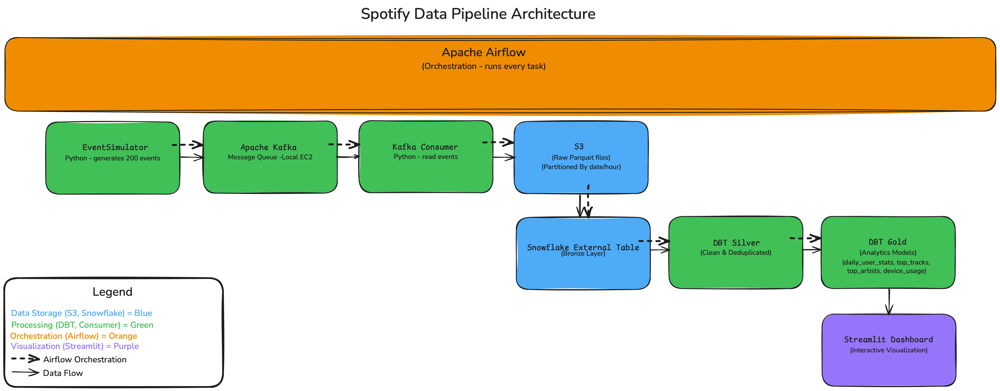

# Spotify Data Pipeline

A production-ready data engineering project that simulates Spotify's data infrastructure, processing listening events through a multi-layer medallion architecture (Bronze → Silver → Gold). Built to demonstrate end-to-end data pipeline skills using industry-standard tools.

🔗 **Live Dashboard:** [https://spotify-data-pipeline-2025.streamlit.app](https://spotify-data-pipeline-2025.streamlit.app)

---

## 📋 Table of Contents

- [Architecture](#architecture)
- [Tech Stack](#tech-stack)
- [Data Flow](#data-flow)
- [Project Phases](#project-phases)
- [Prerequisites](#prerequisites)
- [Setup & Installation](#setup--installation)
- [Running the Pipeline](#running-the-pipeline)
- [Dashboard](#dashboard)
- [Project Structure](#project-structure)
- [Future Enhancements](#future-enhancements)

---

## 🏗️ Architecture



The pipeline follows a medallion architecture pattern with three distinct layers:

- **Bronze Layer:** Raw data stored as Parquet files in S3, accessed via Snowflake external tables
- **Silver Layer:** Cleaned, deduplicated data with quality tests
- **Gold Layer:** Analytical models optimized for business intelligence and visualization

---

## 🛠️ Tech Stack

| Component | Technology | Version | Purpose |
|-----------|-----------|---------|---------|
| **Event Generation** | Python | 3.13.2 | Simulates Spotify listening events |
| **Message Queue** | Apache Kafka | 2.13 | Handles real-time event streaming |
| **Cloud Storage** | AWS S3 | - | Stores raw Parquet files (partitioned by date/hour) |
| **Compute** | AWS EC2 | t3.small | Hosts Kafka, Airflow, and pipeline orchestration |
| **Data Warehouse** | Snowflake | 9.38.4 | Hosts Bronze/Silver/Gold layers |
| **Transformations** | DBT | 1.10.15 | Data modeling and business logic |
| **Orchestration** | Apache Airflow | 2.8.1 | Schedules and monitors pipeline tasks |
| **Visualization** | Streamlit | 1.40.1 | Interactive dashboard for analytics |
| **Infrastructure** | Docker Compose | 2.24.0 | Containerized deployment |

---

## 🔄 Data Flow

⚠️ **PHASE 5 CHANGE:** Steps 1-2 will be replaced with real Spotify API integration

1. **Event Generation** ⚠️ PHASE 5: Real Spotify API
   - EventSimulator generates 200 synthetic listening events per run
   - Events include: track_id, user_id, played_at, duration_ms, device_type
   - Events distributed randomly across 24 hours for realistic data

2. **Event Streaming** ⚠️ PHASE 5: Real-time API webhook
   - Events published to Kafka topic: `spotify-plays`
   - Kafka handles message buffering and delivery guarantees

3. **Data Ingestion**
   - Kafka Consumer reads events in batches (100 events or 60s timeout)
   - Events written to S3 as Parquet files: `s3://spotify-data-lake-sunil-2025/raw_events/year=YYYY/month=MM/day=DD/hour=HH/`

4. **Bronze Layer**
   - Snowflake external table points to S3 bucket
   - Raw data accessible via SQL without copying

5. **Silver Layer (DBT)**
   - Deduplication based on event_id
   - Data quality tests (not_null, unique, accepted_values)
   - Type casting and standardization

6. **Gold Layer (DBT)**
   - `daily_user_stats`: Daily listening metrics
   - `top_tracks`: Most played tracks with rankings
   - `top_artists`: Most played artists with unique track counts
   - `device_usage`: Listening patterns by device type

7. **Visualization**
   - Streamlit dashboard connects to Snowflake Gold layer
   - Real-time updates as new data flows through pipeline

---

## 📊 Project Phases

### Phase 1: Infrastructure Setup ✅
- AWS account configuration (EC2 t3.small, S3 bucket, IAM roles)
- Snowflake warehouse and database setup
- Local Kafka cluster on EC2
- EventSimulator for synthetic data generation

### Phase 2: DBT Transformations ✅
- Bronze layer: External table configuration
- Silver layer: Data cleaning and deduplication
- Gold layer: 4 analytical models with comprehensive tests
- DBT documentation and lineage graphs

### Phase 3: Airflow Orchestration ✅
- Production DAG: 10 tasks, ~6 minute runtime
- Monitoring DAG: Data quality checks every 30 minutes
- Error handling: 3 retries with exponential backoff
- Email alerts via Gmail SMTP
- Memory optimization for t3.small instance (2GB RAM + 2GB swap)

### Phase 4: Dashboard & Documentation ✅
- **Phase 4.1:** Streamlit dashboard (5 pages: Overview, Trends, Top Tracks, Top Artists, Device Usage)
- **Phase 4.2:** System architecture diagram, README, setup guide

### Phase 5: Real Spotify API Integration 🔜
⚠️ **FUTURE ENHANCEMENT**
- Replace EventSimulator with Spotify Web API
- Implement OAuth 2.0 authentication for user listening history
- Build simple recommendation engine based on listening patterns

---

## 📦 Prerequisites

### Required Accounts
- **AWS Account** with IAM permissions for EC2, S3
- **Snowflake Account** (free trial available)
- **GitHub Account** for version control
- **Gmail Account** for Airflow email alerts (with App Password)

### Local Environment
- **Python:** 3.13.2 or higher
- **Docker & Docker Compose:** 2.24.0 or higher
- **AWS CLI:** 2.32.12 or higher
- **Git:** Latest version

### EC2 Instance Specifications
- **Instance Type:** t3.small (2 vCPU, 2GB RAM)
- **OS:** Ubuntu 24.04 LTS
- **Storage:** 20GB SSD
- **Region:** us-east-2
- **Additional:** 2GB swap configured for stability

---

## 🚀 Setup & Installation

### 1. Clone Repository

```bash
git clone https://github.com/sunilmakkar/spotify-data-pipeline.git
cd spotify-data-pipeline
```

### 2. Configure Environment Variables

Create a `.env` file in the project root:

```bash
# AWS Configuration
AWS_ACCESS_KEY_ID=your_access_key
AWS_SECRET_ACCESS_KEY=your_secret_key
S3_BUCKET=spotify-data-lake-sunil-2025
AWS_REGION=us-east-2

# Kafka Configuration
KAFKA_BOOTSTRAP_SERVERS=localhost:9092
KAFKA_API_KEY=your_kafka_key
KAFKA_API_SECRET=your_kafka_secret

# Snowflake Configuration
SNOWFLAKE_ACCOUNT=your_account_id
SNOWFLAKE_USER=your_username
SNOWFLAKE_PASSWORD=your_password
SNOWFLAKE_WAREHOUSE=SPOTIFY_WH
SNOWFLAKE_DATABASE=SPOTIFY_DATA
SNOWFLAKE_SCHEMA=RAW

# Spotify Configuration (for Phase 5)
SPOTIFY_CLIENT_ID=your_client_id
SPOTIFY_CLIENT_SECRET=your_client_secret
SPOTIFY_REDIRECT_URI=http://localhost:8888/callback

# Gmail SMTP (for Airflow alerts)
GMAIL_USER=your_email@gmail.com
GMAIL_APP_PASSWORD=your_app_password

# Airflow
AIRFLOW_UID=50000
```

### 3. AWS Setup

```bash
# Configure AWS CLI
aws configure

# Create S3 bucket
aws s3 mb s3://spotify-data-lake-sunil-2025 --region us-east-2

# Verify bucket creation
aws s3 ls
```

### 4. Snowflake Setup

Run the following SQL in Snowflake:

```sql
-- Create warehouse
CREATE WAREHOUSE IF NOT EXISTS SPOTIFY_WH
    WAREHOUSE_SIZE = 'X-SMALL'
    AUTO_SUSPEND = 60
    AUTO_RESUME = TRUE;

-- Create database and schemas
CREATE DATABASE IF NOT EXISTS SPOTIFY_DATA;
CREATE SCHEMA IF NOT EXISTS SPOTIFY_DATA.BRONZE;
CREATE SCHEMA IF NOT EXISTS SPOTIFY_DATA.SILVER;
CREATE SCHEMA IF NOT EXISTS SPOTIFY_DATA.GOLD;

-- Create external table (Bronze layer)
CREATE OR REPLACE EXTERNAL TABLE SPOTIFY_DATA.BRONZE.raw_plays
    (event_id VARCHAR AS (value:event_id::VARCHAR),
     user_id VARCHAR AS (value:user_id::VARCHAR),
     track_id VARCHAR AS (value:track_id::VARCHAR),
     played_at TIMESTAMP AS (value:played_at::TIMESTAMP),
     duration_ms INT AS (value:duration_ms::INT),
     device_type VARCHAR AS (value:device_type::VARCHAR))
    LOCATION = @SPOTIFY_DATA.BRONZE.spotify_stage
    FILE_FORMAT = (TYPE = PARQUET)
    AUTO_REFRESH = FALSE;
```

### 5. Kafka Setup (EC2)

```bash
# SSH into EC2 instance
ssh -i your-key.pem ubuntu@your-ec2-ip

# Install Kafka
wget https://downloads.apache.org/kafka/3.5.1/kafka_2.13-3.5.1.tgz
tar -xzf kafka_2.13-3.5.1.tgz
cd kafka_2.13-3.5.1

# Start Zookeeper
bin/zookeeper-server-start.sh config/zookeeper.properties &

# Start Kafka
bin/kafka-server-start.sh config/server.properties &

# Create topics
bin/kafka-topics.sh --create --topic spotify-plays --bootstrap-server localhost:9092 --partitions 3 --replication-factor 1
bin/kafka-topics.sh --create --topic spotify-events --bootstrap-server localhost:9092 --partitions 3 --replication-factor 1
bin/kafka-topics.sh --create --topic spotify-likes --bootstrap-server localhost:9092 --partitions 3 --replication-factor 1
bin/kafka-topics.sh --create --topic spotify-skips --bootstrap-server localhost:9092 --partitions 3 --replication-factor 1
```

### 6. Docker Setup (EC2)

```bash
# Clone repo on EC2
git clone https://github.com/sunilmakkar/spotify-data-pipeline.git
cd spotify-data-pipeline

# Create swap space (for t3.small memory optimization)
sudo fallocate -l 2G /swapfile
sudo chmod 600 /swapfile
sudo mkswap /swapfile
sudo swapon /swapfile

# Make swap permanent
echo '/swapfile none swap sw 0 0' | sudo tee -a /etc/fstab

# Start Docker containers
docker-compose up -d

# Verify containers are running
docker-compose ps
```

### 7. DBT Setup

```bash
# Install DBT (if running locally)
pip install dbt-core==1.10.15 dbt-snowflake==1.8.3

# Configure DBT profile (already mounted in Docker)
# Profile location: dbt/profiles.yml

# Test DBT connection
docker-compose exec airflow-scheduler bash -c "cd /opt/airflow/dbt && dbt debug"

# Run DBT models
docker-compose exec airflow-scheduler bash -c "cd /opt/airflow/dbt && dbt run"
```

---

## ▶️ Running the Pipeline

### Access Airflow UI

1. Navigate to: `http://your-ec2-ip:8082`
2. Login credentials: `airflow` / `airflow`

### Trigger Pipeline Manually

1. In Airflow UI, find DAG: `spotify_data_basic`
2. Click the play button (▶) to trigger
3. Monitor progress in Graph view (~6 minutes runtime)

### Pipeline Tasks (in order)

1. **start** - Dummy task marking pipeline start
2. **generate_events** - EventSimulator creates 200 listening events ⚠️ PHASE 5: Spotify API call
3. **start_consumer** - Launches Kafka consumer process
4. **wait_for_s3_files** - Polls S3 until Parquet files appear
5. **stop_consumer** - Terminates consumer process
6. **refresh_snowflake_table** - Refreshes external table to detect new S3 files
7. **dbt_compile** - Compiles DBT project
8. **dbt_run_silver** - Runs Silver layer transformations
9. **dbt_run_gold** - Runs Gold layer analytics models
10. **dbt_test** - Executes data quality tests

### Monitoring DAG

- **DAG ID:** `data_quality_monitoring`
- **Schedule:** Every 30 minutes
- **Checks:** Row counts, null values, duplicate detection, value ranges, freshness
- **Alerts:** Email notifications on failures

---

## 📈 Dashboard

**Live URL:** [https://spotify-data-pipeline-2025.streamlit.app](https://spotify-data-pipeline-2025.streamlit.app)

### Dashboard Pages

1. **Overview**
   - Total plays, unique tracks, unique artists
   - Total listening time
   - Data date range

2. **Trends**
   - Daily plays over time (line chart)
   - Daily listening hours over time (line chart)

3. **Top Tracks**
   - Bar chart of top 5 most played tracks
   - Hover details: artist name, play count

4. **Top Artists**
   - Bar chart of top 5 most played artists
   - Shows play count and unique track count

5. **Device Usage**
   - Pie chart: listening distribution by device type
   - Bar chart: play counts per device

### Running Dashboard Locally

```bash
cd streamlit_dashboard

# Install dependencies
pip install -r requirements.txt

# Create secrets file
mkdir .streamlit
cat > .streamlit/secrets.toml << EOF
[snowflake]
user = "your_username"
password = "your_password"
account = "your_account_id"
warehouse = "SPOTIFY_WH"
database = "SPOTIFY_DATA"
schema = "GOLD"
EOF

# Run dashboard
streamlit run app.py
```

Dashboard will open at `http://localhost:8501`

---

## 📁 Project Structure

```
spotify-data-pipeline/
├── .devcontainer/
│   └── devcontainer.json
├── config/
├── dags/
│   ├── data_quality_monitoring.py         # Monitoring DAG
│   └── spotify_pipeline_basic.py          # Main production DAG
├── dbt/
│   ├── analyses/
│   ├── dbt_packages/
│   │   └── dbt_utils/
│   ├── logs/
│   ├── macros/
│   │   └── .gitkeep
│   │   └── get_custom_schema.sql
│   ├── models/
│   │   ├── bronze/
│   │   │   └── sources.yml
│   │   ├── gold/
│   │   │   ├── daily_user_stats.sql
│   │   │   ├── device_usage.sql
│   │   │   ├── schema.yml
│   │   │   ├── top_artists.sql
│   │   │   └── top_tracks.sql
│   │   └── silver/
│   │       ├── silver_plays.sql
│   │       └── silver_plays.yml
│   ├── seeds/
│   ├── snapshots/
│   ├── target/
│   ├── tests/
│   ├── .user.yml
│   ├── dbt_project.yml
│   ├── package-lock.yml
│   ├── packages.yml
│   ├── profiles.yml
│   └── README.md
├── docs/
│   ├── SETUP.md
│   ├── airflow/
│   │   ├── airflow_architecture.md
│   │   ├── airflow_setup.md
│   │   └── troubleshooting.md
│   ├── architecture/
│   │   └── system_architecture.png
│   ├── dbt/
│   │   ├── erds/
│   │   ├── lineage/
│   │   └── screenshots/
│   ├── logs/
│   ├── plugins/
│   └── scripts/
│       └── dashboard.py
├── sql/
│   ├── ddl/
│   │   └── spotify_DDL.sql
│   └── validation/
│       └── data_validation_silver.sql
├── src/
│   ├── __pycache__/
│   ├── __init__.py
│   ├── event_simulator.py                 # Synthetic event generator ⚠️ PHASE 5: Replace with Spotify API
│   ├── kafka_consumer_background.py
│   ├── kafka_consumer.py                  # Kafka to S3 consumer
│   ├── kafka_producer.py
│   ├── simulator_last_date.txt            # Date tracker for sequential data
│   └── spotify_client.py
├── streamlit_dashboard/
│   ├── __pycache__/
│   ├── .streamlit/
│   │   └── secrets.toml                   # Snowflake credentials (not committed)
│   ├── app.py                             # Main dashboard application
│   ├── requirements.txt                   # Dashboard dependencies
│   └── utils.py                           # Snowflake connection helpers
├── tests/
│   ├── __pycache__/
│   ├── __init__.py
│   ├── test_kafka.py
│   ├── test_parquet_validation.py
│   ├── test_s3.py
│   ├── test_snowflake_external_table.py
│   └── test_snowflake.py
├── venv/
├── .env                                   # Environment variables (not committed)
├── .gitignore                             # Git ignore rules
├── config.py                              # Centralized configuration
├── docker-compose.yml                     # Airflow containerization
├── Dockerfile                             # Custom Airflow image
├── project.md
├── README.md                              # This file
└── requirements.txt                       # Python dependencies
```

---

## 🚀 Future Enhancements

### Phase 5: Real Spotify API Integration ⚠️

**What Will Change:**

1. **Authentication**
   - Implement OAuth 2.0 authorization flow
   - Store refresh tokens securely
   - Handle token expiration and renewal

2. **Data Ingestion** (Replaces EventSimulator)
   - Call Spotify Web API `/v1/me/player/recently-played` endpoint
   - Fetch listening history (last 50 tracks)
   - Run hourly to capture recent listening data

3. **Simple Recommendation Engine**
   - Analyze listening patterns (top genres, artists, tracks)
   - Build collaborative filtering model
   - Generate personalized track recommendations

**Files That Will Change:**
- ✏️ `src/event_simulator.py` → Rewrite to `src/spotify_api_client.py`
- ✏️ `dags/spotify_pipeline_basic.py` → Update task: `generate_events` → `fetch_spotify_data`
- ✏️ `streamlit_dashboard/app.py` → Add recommendations page

---

## 📝 Key Learnings

1. **Medallion Architecture:** Separating raw, cleaned, and analytical layers improves maintainability and query performance
2. **Memory Optimization:** Configured Airflow for t3.small (2GB RAM) by limiting parallelism and adding swap space
3. **Error Handling:** Implemented retries with exponential backoff to handle transient failures gracefully
4. **Data Quality:** DBT tests catch issues early before bad data propagates to Gold layer
5. **Incremental Processing:** Date tracker ensures sequential data generation without duplicates
6. **Monitoring:** Separate monitoring DAG provides continuous data quality visibility

---

## 🤝 Contributing

This is a portfolio project, but feedback and suggestions are welcome! Feel free to:
- Open issues for bugs or enhancement ideas
- Submit pull requests for improvements
- Share your own implementations or variations

---

## 📄 License

This project is open source and available under the MIT License.

---

## 👤 Author

**Sunil Makkar**
- GitHub: [@sunilmakkar](https://github.com/sunilmakkar)
- Project Link: [https://github.com/sunilmakkar/spotify-data-pipeline](https://github.com/sunilmakkar/spotify-data-pipeline)
- Live Dashboard: [https://spotify-data-pipeline-2025.streamlit.app](https://spotify-data-pipeline-2025.streamlit.app)

---

## 🙏 Acknowledgments

- **Spotify Web API** for future integration possibilities
- **Snowflake** for powerful data warehousing capabilities
- **Apache Airflow** community for excellent orchestration tools
- **DBT** for modern data transformation framework
- **Streamlit** for rapid dashboard development

---

**Built with ❤️ as a portfolio project to demonstrate data engineering skills**