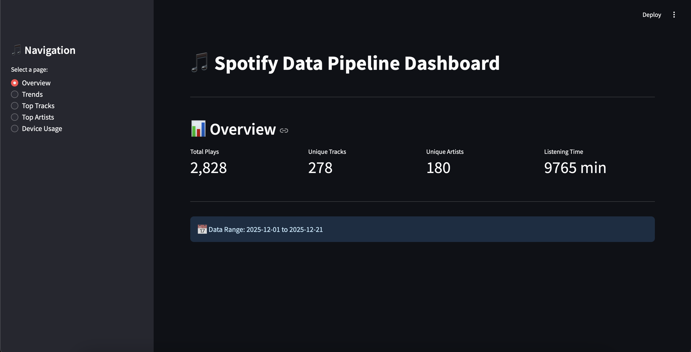
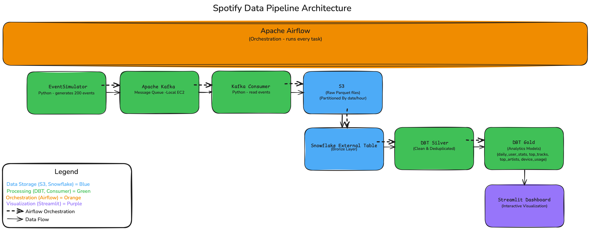
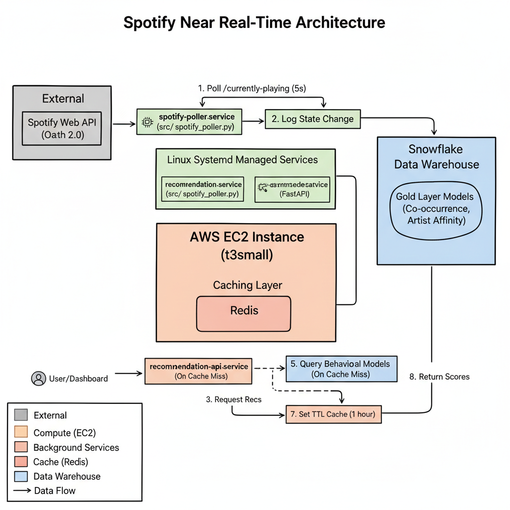
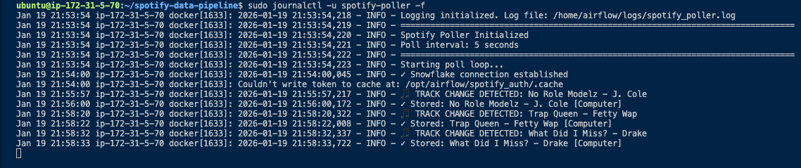
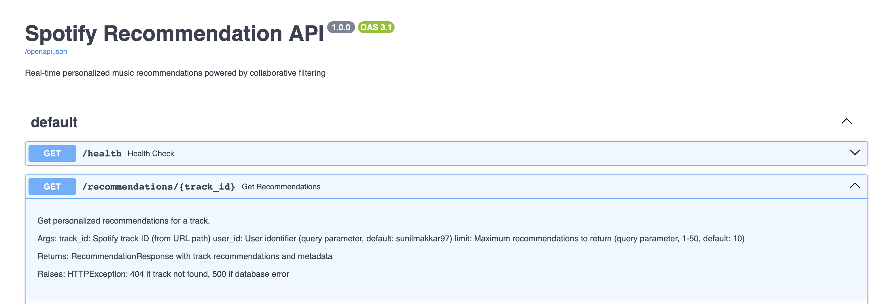

# Spotify Data Platform

A production-grade, hybrid data engineering project that simulates Spotify's data infrastructure and processes real-time and batch listening data through a multi-layer Medallion Architecture (Bronze → Silver → Gold). This project demonstrates a full data lifecycle: from event-driven ingestion and warehouse modeling to real-time serving via a sub-second recommendation API.

🔗 **Live Dashboard Screenshot:** 

📖 **API Documentation:** [Detailed API Specs](docs/api/README.md)

## 📋 Table of Contents
- [Architecture](#architecture)
- [Tech Stack](#tech-stack)
- [Data Flow](#data-flow)
- [Project Phases](#project-phases)
- [Prerequisites](#prerequisites)
- [Setup & Installation](#setup--installation)
- [Running the Pipeline](#running-the-pipeline)
- [Serving Layer & API](#serving-layer--api)
- [Dashboard](#dashboard)
- [Project Structure](#project-structure)

---

## 🏗️ Architecture

The platform operates on two distinct data velocities, unified within Snowflake:

- **Path A (Batch):** Spotify API → Kafka → S3 → Snowflake (Orchestrated by Airflow).



- **Path B (Near Real-Time):** Spotify API → Python Poller (Systemd) → Snowflake → FastAPI (Redis Cache).



The batch pipeline follows a medallion architecture pattern with three distinct layers:

- **Bronze Layer:** Raw data stored as Parquet files in S3, accessed via Snowflake external tables
- **Silver Layer:** Cleaned, deduplicated data with quality tests
- **Gold Layer:** Analytical models optimized for business intelligence and visualization

---

## 🛠️ Tech Stack

| Component      | Technology      | Version | Purpose                                      |
|----------------|-----------------|---------|----------------------------------------------|
| Streaming      | Apache Kafka    | 2.13    | High-throughput event buffering              |
| Data Lake      | AWS S3          | -       | Partitioned Parquet storage (Bronze Layer)   |
| Warehouse      | Snowflake       | 9.38.4  | Unified compute for Silver/Gold modeling     |
| Modeling       | dbt Core        | 1.10.15 | SQL-based transformations & quality testing  |
| Orchestration  | Apache Airflow  | 2.8.1   | Batch workflow scheduling & monitoring       |
| Serving API    | FastAPI         | 0.115.0 | Sub-second recommendation serving            |
| Cache          | Redis           | 7.0     | In-memory storage for API performance        |
| Monitoring     | Systemd         | -       | Linux daemon management for real-time services |
| Visualization  | Streamlit       | 1.40.1  | End-user analytical dashboard                |

---

## 🔄 Data Flow

### 1. Ingestion (Hybrid Velocity)
- **Spotify API Integration:** Replaced synthetic simulators with real-world data via OAuth 2.0.
- **Batch Path:** Historical listening events are produced to Kafka, batched into Parquet format, and landed in AWS S3 partitioned by year/month/day/hour.
- **Near Real-Time Path:** A custom Python Poller daemon checks the Spotify `/currently-playing` endpoint every 5 seconds, logging state changes directly to Snowflake.

### 2. Transformation (dbt Medallion Architecture)
- **Bronze Layer:** Raw data accessed via Snowflake external tables.
- **Silver Layer:** Data is deduplicated, type-cast, and validated with strict quality tests.
- **Gold Layer:** Business-ready models calculate daily user metrics, artist affinity, and track co-occurrence patterns.

### 3. Serving (Recommendation Engine)
- **Collaborative Filtering:** Recommendations are generated using a weighted scoring model: (Co-occurrence * 0.7) + (Artist Affinity * 0.3).
- **Performance:** FastAPI serves these models with Redis caching, achieving <100ms response times for cache hits.

---

## 📊 Project Phases

### Phase 1-3: Core Infrastructure & Batch Pipeline ✅
- Built the AWS/Snowflake stack and Kafka streaming layer.
- Implemented dbt Medallion modeling and Airflow orchestration for batch processing.

### Phase 4-5: Real API & Behavioral Modeling ✅
- Integrated real Spotify Web API for historical backfills and hourly ingestion.
- Pivoted from audio-feature modeling to Behavioral Collaborative Filtering using co-occurrence and artist preference.

### Phase 6: Real-Time Serving & Automation ✅
- Deployed FastAPI service with a Redis caching layer for recommendation serving.
- Implemented background daemons via Systemd to manage the polling engine and API services.

---

## 📦 Prerequisites

### Required Accounts
- **AWS Account** (EC2, S3, IAM).
- **Snowflake Account** (Warehouse, Database, Schemas).
- **Spotify Developer Account** (API Client ID/Secret).
- **GitHub Account** for version control
- **Gmail Account** (For Airflow SMTP alerts).

### Local Environment
- **Python:** 3.13.2 or higher
- **Docker & Docker Compose:** 2.24.0 or higher
- **Redis Server:** 7.0+ (For API caching).
- **AWS CLI:** 2.32.12 or higher
- **Git:** Latest version

### EC2 Instance Specifications
- **Instance Type:** t3.small (2 vCPU, 2GB RAM)
- **OS:** Ubuntu 24.04 LTS
- **Storage:** 20GB SSD
- **Region:** us-east-2
- **Additional:** 2GB swap configured for stability

---

## 🚀 Setup & Installation

### 1. Clone Repository

```bash
git clone https://github.com/sunilmakkar/spotify-data-pipeline.git
cd spotify-data-pipeline
```

### 2. Configure Environment Variables

Create a `.env` file in the project root:

```bash
# AWS Configuration
AWS_ACCESS_KEY_ID=your_access_key
AWS_SECRET_ACCESS_KEY=your_secret_key
S3_BUCKET=spotify-data-lake-sunil-2025
AWS_REGION=us-east-2

# Kafka Configuration
KAFKA_BOOTSTRAP_SERVERS=localhost:9092
KAFKA_API_KEY=your_kafka_key
KAFKA_API_SECRET=your_kafka_secret

# Snowflake Configuration
SNOWFLAKE_ACCOUNT=your_account_id
SNOWFLAKE_USER=your_username
SNOWFLAKE_PASSWORD=your_password
SNOWFLAKE_WAREHOUSE=SPOTIFY_WH
SNOWFLAKE_DATABASE=SPOTIFY_DATA
SNOWFLAKE_SCHEMA=RAW

# Spotify Configuration (for Phase 5)
SPOTIFY_CLIENT_ID=your_client_id
SPOTIFY_CLIENT_SECRET=your_client_secret
SPOTIFY_REDIRECT_URI=http://localhost:8888/callback

# Gmail SMTP (for Airflow alerts)
GMAIL_USER=your_email@gmail.com
GMAIL_APP_PASSWORD=your_app_password

# Airflow
AIRFLOW_UID=50000
```

### 3. AWS Setup

```bash
# Configure AWS CLI
aws configure

# Create S3 bucket
aws s3 mb s3://spotify-data-lake-sunil-2025 --region us-east-2

# Verify bucket creation
aws s3 ls
```

### 4. Snowflake Setup

Run the following SQL in Snowflake:

```sql
-- Create warehouse
CREATE WAREHOUSE IF NOT EXISTS SPOTIFY_WH
    WAREHOUSE_SIZE = 'X-SMALL'
    AUTO_SUSPEND = 60
    AUTO_RESUME = TRUE;

-- Create database and schemas
CREATE DATABASE IF NOT EXISTS SPOTIFY_DATA;
CREATE SCHEMA IF NOT EXISTS SPOTIFY_DATA.BRONZE;
CREATE SCHEMA IF NOT EXISTS SPOTIFY_DATA.SILVER;
CREATE SCHEMA IF NOT EXISTS SPOTIFY_DATA.GOLD;

-- Create external table (Bronze layer)
CREATE OR REPLACE EXTERNAL TABLE SPOTIFY_DATA.BRONZE.raw_plays
    (event_id VARCHAR AS (value:event_id::VARCHAR),
     user_id VARCHAR AS (value:user_id::VARCHAR),
     track_id VARCHAR AS (value:track_id::VARCHAR),
     played_at TIMESTAMP AS (value:played_at::TIMESTAMP),
     duration_ms INT AS (value:duration_ms::INT),
     device_type VARCHAR AS (value:device_type::VARCHAR))
    LOCATION = @SPOTIFY_DATA.BRONZE.spotify_stage
    FILE_FORMAT = (TYPE = PARQUET)
    AUTO_REFRESH = FALSE;
```

### 5. Kafka Setup (EC2)

```bash
# SSH into EC2 instance
ssh -i your-key.pem ubuntu@your-ec2-ip

# Install Kafka
wget https://downloads.apache.org/kafka/3.5.1/kafka_2.13-3.5.1.tgz
tar -xzf kafka_2.13-3.5.1.tgz
cd kafka_2.13-3.5.1

# Start Zookeeper
bin/zookeeper-server-start.sh config/zookeeper.properties &

# Start Kafka
bin/kafka-server-start.sh config/server.properties &

# Create topics
bin/kafka-topics.sh --create --topic spotify-plays --bootstrap-server localhost:9092 --partitions 3 --replication-factor 1
bin/kafka-topics.sh --create --topic spotify-events --bootstrap-server localhost:9092 --partitions 3 --replication-factor 1
bin/kafka-topics.sh --create --topic spotify-likes --bootstrap-server localhost:9092 --partitions 3 --replication-factor 1
bin/kafka-topics.sh --create --topic spotify-skips --bootstrap-server localhost:9092 --partitions 3 --replication-factor 1
```

### 6. Docker Setup (EC2)

```bash
# Clone repo on EC2
git clone https://github.com/sunilmakkar/spotify-data-pipeline.git
cd spotify-data-pipeline

# Create swap space (for t3.small memory optimization)
sudo fallocate -l 2G /swapfile
sudo chmod 600 /swapfile
sudo mkswap /swapfile
sudo swapon /swapfile

# Make swap permanent
echo '/swapfile none swap sw 0 0' | sudo tee -a /etc/fstab

# Start Docker containers
docker-compose up -d

# Verify containers are running
docker-compose ps
```

### 7. DBT Setup

```bash
# Install DBT (if running locally)
pip install dbt-core==1.10.15 dbt-snowflake==1.8.3

# Configure DBT profile (already mounted in Docker)
# Profile location: dbt/profiles.yml

# Test DBT connection
docker-compose exec airflow-scheduler bash -c "cd /opt/airflow/dbt && dbt debug"

# Run DBT models
docker-compose exec airflow-scheduler bash -c "cd /opt/airflow/dbt && dbt run"
```

### 8. Near Real-Time Poller Setup (Systemd)

To enable near real-time playback detection, the platform uses a background daemon managed by Systemd. This service continuously polls the Spotify API and logs state changes to Snowflake.

- Configure the Service File: The service configuration is located in `systemd/spotify-poller.service`. You must update the file paths within this file to match your EC2 environment:
```
[Unit]
Description=Spotify Currently Playing Poller
After=network.target

[Service]
# Update these paths to match your project location
User=ubuntu
WorkingDirectory=/home/ubuntu/spotify-data-pipeline
ExecStart=/home/ubuntu/spotify-data-pipeline/venv/bin/python src/spotify_poller.py
Restart=always
RestartSec=5

[Install]
WantedBy=multi-user.target
```
- Deploy and Enable the Background Service
- Copy the service file to the system directory, then enable it to ensure it starts automatically on boot:
```
# Copy the service file to systemd
sudo cp systemd/spotify-poller.service /etc/systemd/system/

# Reload systemd to recognize the new service
sudo systemctl daemon-reload

# Enable the service for auto-start on boot
sudo systemctl enable spotify-poller

# Start the service
sudo systemctl start spotify-poller
```

- Monitor the Service Logs
- Since the poller runs as a background process, you can verify its activity by following the system logs:
```
# View real-time logs for the poller
sudo journalctl -u spotify-poller -f
```

### 9. Recommendation API Setup (Systemd)

Similar to the poller, the FastAPI recommendation engine is managed as a background service to ensure sub-second response times and high availability.

- Deploy the API Service
- Follow the same process in step 8 to enable the FastAPI serving layer:
```
# Copy the service file
sudo cp systemd/recommendation-api.service /etc/systemd/system/

# Reload and enable
sudo systemctl daemon-reload
sudo systemctl enable recommendation-api

# Start the service
sudo systemctl start recommendation-api
```

- Verify Service Status
```
sudo systemctl status recommendation-api
```

---

## ▶️ Running the Pipeline

### Batch Pipeline (Airflow)

1. Access Airflow UI at `http://your-ec2-ip:8082`.
2. Trigger the `spotify_pipeline_basic` DAG to run the ingestion and dbt models.

### Trigger Pipeline Manually

1. In Airflow UI, find DAG: `spotify_data_basic`
2. Click the play button (▶) to trigger
3. Monitor progress in Graph view (~6 minutes runtime)

### Pipeline Tasks (in order)

1. **start** - Dummy task marking pipeline start
2. **generate_events** - EventSimulator creates 200 listening events ⚠️ PHASE 5: Spotify API call
3. **start_consumer** - Launches Kafka consumer process
4. **wait_for_s3_files** - Polls S3 until Parquet files appear
5. **stop_consumer** - Terminates consumer process
6. **refresh_snowflake_table** - Refreshes external table to detect new S3 files
7. **dbt_compile** - Compiles DBT project
8. **dbt_run_silver** - Runs Silver layer transformations
9. **dbt_run_gold** - Runs Gold layer analytics models
10. **dbt_test** - Executes data quality tests

### Monitoring DAG

- **DAG ID:** `data_quality_monitoring`
- **Schedule:** Every 30 minutes
- **Checks:** Row counts, null values, duplicate detection, value ranges, freshness
- **Alerts:** Email notifications on failures

### Real-Time Services (Systemd)
- Use `journalctl -u spotify-poller -f` to monitor real-time playback detection.
- Use `journalctl -u recommendation-api -f` to view API request logs.



---

## ⚡ Serving Layer & API

The platform includes a production-ready API for consuming processed data. For detailed endpoint specifications, performance benchmarks, and service management commands, see the [API Documentation](docs/api/README.md).

**Key API Features:**
- `GET /recommendations`: Serves personalized tracks based on current playback.
- **Swagger UI:** Interactive testing available at `/docs`.



---

## 📈 Dashboard

**Live URL:** [https://spotify-data-pipeline-2025.streamlit.app](https://spotify-data-pipeline-2025.streamlit.app)

### Dashboard Pages

1. **Overview**
   - Total plays, unique tracks, unique artists
   - Total listening time
   - Data date range

2. **Trends**
   - Daily plays over time (line chart)
   - Daily listening hours over time (line chart)

3. **Top Tracks**
   - Bar chart of top 5 most played tracks
   - Hover details: artist name, play count

4. **Top Artists**
   - Bar chart of top 5 most played artists
   - Shows play count and unique track count

5. **Device Usage**
   - Pie chart: listening distribution by device type
   - Bar chart: play counts per device

### Running Dashboard Locally

```bash
cd streamlit_dashboard

# Install dependencies
pip install -r requirements.txt

# Create secrets file
mkdir .streamlit
cat > .streamlit/secrets.toml << EOF
[snowflake]
user = "your_username"
password = "your_password"
account = "your_account_id"
warehouse = "SPOTIFY_WH"
database = "SPOTIFY_DATA"
schema = "GOLD"
EOF

# Run dashboard
streamlit run app.py
```

Dashboard will open at `http://localhost:8501`

---

## 📁 Project Structure
```
SPOTIFY-DATA-PIPELINE/
├── api/                   # FastAPI recommendation service source
├── dags/                  # Airflow workflow definitions
├── dbt/                   # dbt models (Bronze, Silver, Gold)
├── docs/                  # Technical specs & service guides
│   └── api/README.md      # Dedicated API documentation
├── src/                   # Core logic (Poller, Clients, Kafka)
├── systemd/               # Linux service configuration files
└── streamlit_dashboard/   # Streamlit UI source code
```

- Full Project Structure Located Here: 

---

## 📝 Key Learnings

### Batch Pipeline

1. **Medallion Architecture:** Separating raw, cleaned, and analytical layers improves maintainability and query performance
2. **Memory Optimization:** Configured Airflow for t3.small (2GB RAM) by limiting parallelism and adding swap space
3. **Error Handling:** Implemented retries with exponential backoff to handle transient failures gracefully
4. **Data Quality:** DBT tests catch issues early before bad data propagates to Gold layer
5. **Incremental Processing:** Date tracker ensures sequential data generation without duplicates
6. **Monitoring:** Separate monitoring DAG provides continuous data quality visibility

# Near Real-Time Poller Service

7. **Custom Polling vs. Webhooks:** ince the Spotify Web API lacks webhook support for playback events, I designed a custom polling service that achieves near real-time detection by monitoring state changes every 5 seconds.
8. **Daemon Management:** Implementing the poller and API as Systemd background services ensured high availability, allowing the real-time engine to persist across sessions and automatically recover from system restarts.
9. **Hybrid Data Velocity:** Managing both hourly batch DAGs and a 5-second polling interval within the same Snowflake environment demonstrated how to unify different data velocities for a single analytical view.
10. **Sub-second Serving:** Leveraging **Redis caching** for the recommendation API highlighted the importance of in-memory storage to reduce latency from ~700ms (database query) to <100ms (cache hit) for end-user applications.

---

# Spotify Data Pipeline

**Status**: 🔴 **Decommissioned** (January 2026)

This project was successfully built and deployed from November 2025 to 
January 2026. Infrastructure has been shut down to avoid ongoing cloud 
costs. All documentation, code, and evidence of the working system is 
preserved in this repository.

## To Run This Project

This project requires:
- Confluent Cloud account or local Kafka cluster
- Snowflake account with appropriate credentials
- Docker environment
- [Setup instructions preserved for reference]

---

## 🙏 Acknowledgments

- **Spotify Web API** for future integration possibilities
- **Snowflake** for powerful data warehousing capabilities
- **Apache Airflow** community for excellent orchestration tools
- **DBT** for modern data transformation framework
- **Streamlit** for rapid dashboard development

---

## 👤 Author

**Sunil Makkar**

- GitHub: [@sunilmakkar](https://github.com/sunilmakkar)
- Project Link: https://github.com/sunilmakkar/spotify-data-pipeline

Built with ❤️ as a portfolio project to demonstrate modern hybrid data engineering skills.